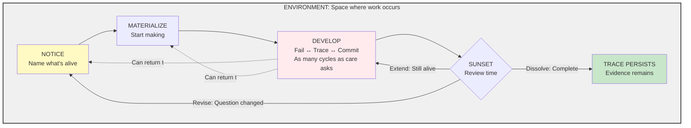
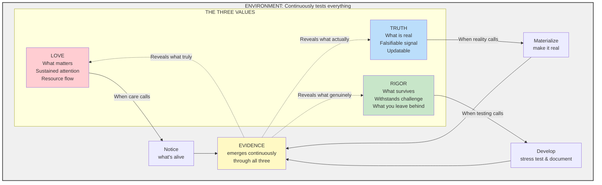
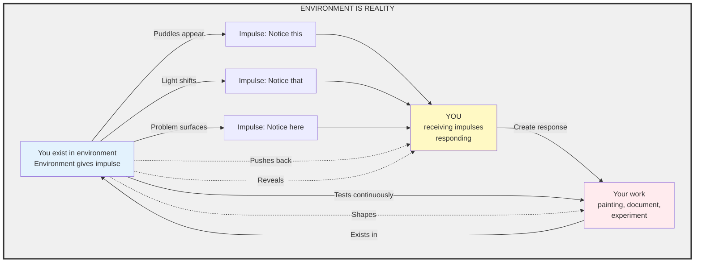
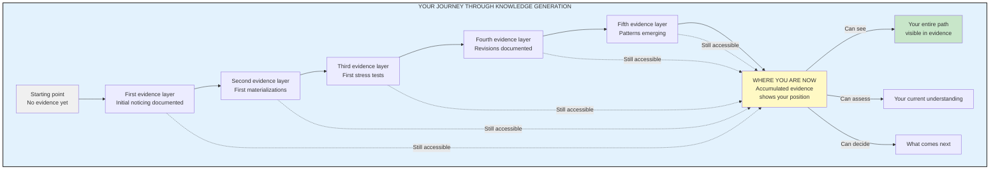
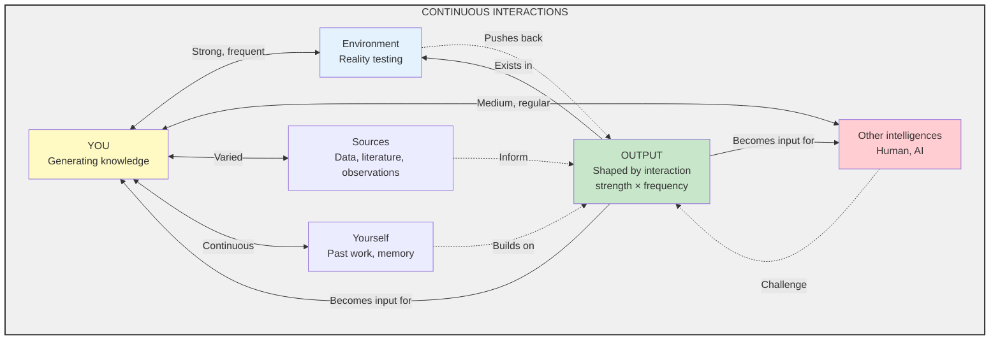
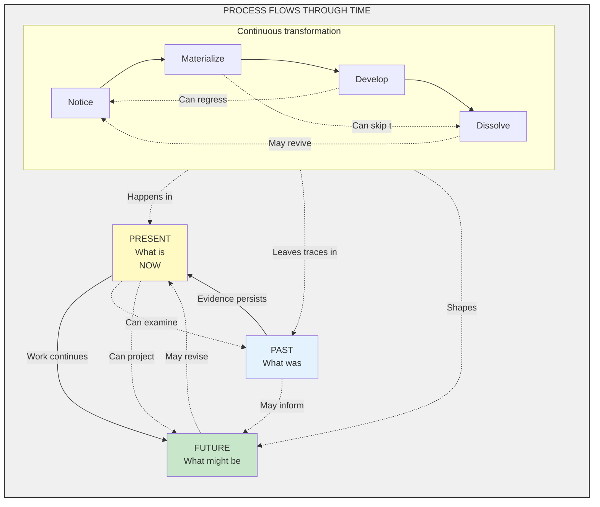

# Living Research Protocol - Visual Guide
*Choose your path based on how you learn*

---

## Quick Start: The Map

**For those who want to start using LRP immediately.**

### The Operations View - What You Do

### Story: What You Do

Something pulls your attention. You can't stop thinking about it.

**Notice** - You name it. "Puddles appearing outside my control." "Light on water at dawn." You put words to what's alive.

**Materialize** - You start making. First brushstroke. First word. As soon as you begin, you're inside the work. Evidence starts accumulating.

**Develop** - You live here. Fail, Trace, and Commit happen together, intertwined. You stress test your painting by showing it to someone who hates your style. You document what survives and what breaks. You establish ground: "This is where I am now." Then you do it again. As many cycles as care asks for.

Sometimes mid-development, you notice something new - back to Notice. Sometimes you need a different form - back to Materialize.

**Sunset** - Review time arrives. Three paths: Extend (still alive, back to Develop), Revise (question changed, back to Notice), or Dissolve (complete - work stops, trace persists).

All of this happens inside Environment - the space that continuously tests everything.

**This view shows: The modes you move between when generating knowledge.**

**This is enough to start. Use the protocol. Reality will teach you the rest.**

---

## Six Perspectives on Knowledge Generation

**For those who need to see the full picture before engaging.**

Knowledge generation is multidimensional. Below are six perspectives on the same reality. Each is primary. None is complete alone.

**Use what serves you. Study all six if that helps you relax into using the protocol. Or use just the map above and ignore the rest.**

### Perspective 1: Operations View
*Already shown above - what you do*

### Perspective 2: Values View
**"The Navigation - What Guides You"**

### Story: What Guides You

You're working on something. Three forces guide your navigation.

**Love** (what matters) - When care calls, you Notice. Your attention is pulled somewhere. "This matters to me" guides you to name what's alive.

**Truth** (what's real) - When reality calls, you Materialize. "Make it exist in the world" guides you to start creating something testable.

**Rigor** (what survives) - When testing calls, you Develop. "Will this withstand challenge?" guides you to stress test, document, establish ground. Repeat as many cycles as care asks.

**Evidence emerges continuously** through all three. Every notice, every creation, every test produces evidence.

**Then evidence reveals back:**
- What you truly cared about (Love)
- What was actually real (Truth)
- What genuinely survived (Rigor)

**Different people navigate differently.** Some lead with Rigor (stress test first). Some with Love (care first). Some with Truth (reality first). All paths valid. Environment tests everything regardless.

**This view shows: How Love, Truth, and Rigor guide you through the work.**

---

### Perspective 3: Environment View
**"The Impulse - Where Noticing Comes From"**

### Story: Where Noticing Comes From

You don't exist outside environment. You are in it. Always.

**Environment gives impulse.** Puddles appear outside your control. Light shifts on water. A problem surfaces in family courts. You don't choose what calls your attention - environment offers it.

**You receive impulses and respond.** Your attention is pulled. You notice. You name what's alive. You start making something - a painting, a document, an experiment.

**Your work exists in environment.** As soon as you create something, it's no longer just yours. It's in the space. Real. Testable.

**Environment tests continuously.** Reality pushes back. Critics challenge. Time reveals. Your own discomfort signals. The space shapes your work through constant testing.

**You can't work outside environment.** Even thinking happens in physical brain in physical space. Even AI exists on servers in rooms. Everything happens inside environment.

**Environment is not neutral backdrop.** It's active participant. Source of impulses. Continuous tester. The space where knowledge generation happens.

**This view shows: You exist in environment. Environment gives impulses. Environment tests everything. Knowledge emerges from this interaction.**

---

### Perspective 4: Evidence View
**"Where You Are - Accumulation Showing Progress"**

### Story: Where You Are

Evidence is not what you produce at the end. Evidence is what accumulates as you work.

**Every moment produces evidence:**
- You notice puddles - that's evidence of what called your attention
- You take first photograph - that's evidence you started
- You show it to someone harsh - that's evidence of stress testing
- They say "worst I've seen" - that's evidence of challenge
- You examine what survives - that's evidence of your reasoning
- You document the exchange - that's evidence others can trace
- You adjust your approach - that's evidence of learning

**Evidence accumulates in layers.** Each cycle of work adds another layer. Early layers don't disappear - they remain accessible. Your first confused notes. Your initial wrong assumptions. Your gradual corrections. All evidence.

**Evidence shows where you are.** Look at accumulated evidence and you see:
- How far you've come
- What you've learned
- What survived testing
- What broke under pressure
- Where understanding shifted

**Your current position = sum of all evidence layers.**

**Not just final claims.** The whole journey. The dead ends. The breakthroughs. The incremental steps. All visible.

**This view shows: Evidence accumulates continuously. Where you are now = all evidence layers stacked. Progress is visible through accumulation.**

---

### Perspective 5: Interaction View
**"How You Engage - Strength and Frequency Shape Output"**

### Story: How You Engage

Knowledge generation isn't solo. It's continuous interaction.

**You interact with environment.** Reality tests your claims. Puddles appear or don't. Light behaves or doesn't. Courts respond or don't. Strong, frequent interaction with reality shapes output profoundly.

**You interact with other intelligences.** Conversation with me right now. Showing work to harsh critic. Reading others' research. Collaboration with AI. Each interaction tests, challenges, informs. Strength and frequency matter - deep engagement produces different output than surface contact.

**You interact with sources.** Data, literature, observations, experiments. Each source pushes back with its own reality. Strong interaction (deep reading, careful observation) shapes output differently than weak (skimming, casual glancing).

**You interact with yourself.** Your past work. Your memory. Your earlier understanding. Continuous dialogue between past-you and present-you. Sometimes you discover past-you was wrong. That's interaction revealing truth.

**Output emerges from interactions.** Not from you alone. From you ↔ environment ↔ others ↔ sources ↔ yourself. The pattern of interactions - their strength, frequency, quality - determines what emerges.

**Then output becomes new input.** Your work goes back into the interaction field. Others interact with it. Environment tests it. You interact with your own output. The cycle continues.

**This view shows: Knowledge emerges from interaction. Strength × frequency × quality of engagement shapes what you generate. You're never working alone - you're in constant interaction.**

---

### Perspective 6: Process View
**"Flow and Transformation - Movement in Any Direction"**

### Story: Flow and Transformation

Process is what actually happens. It flows. It transforms. It moves in any direction.

**Process flows through time.** Past → Present → Future. But not only forward. Present examines Past (you review old work). Future revises Present (deadline forces completion). Past informs Future (learning persists). Time is not just arrow - it's field.

**Like rewinding and recording tape.** You can go back (examine past evidence). You can pause (establish base point). You can fast-forward (project implications). You can record (document present). You can rewind (revise understanding). All valid movements.

**Transformation happens continuously.** Notice transforms into Materialize. Development transforms understanding. Dissolution transforms work into trace. But also: Development can regress to Notice (realized wrong question). Materialize can skip to Dissolve (realized not viable). Process doesn't follow strict sequence.

**Process is above values and operations.** Values guide, operations express, but process determines what actually happens. Care might guide you to Notice, but process determines if noticing occurs. Rigor might guide you to test, but process determines what survives testing.

**Process serves itself.** Not you. Not values. Not truth. Process flows where energy goes, transforms what needs transforming, dissolves what's complete. You participate in process, but don't control it.

**Environment tests process continuously.** Process that doesn't align with reality dissolves. Process that serves truth survives. Process reveals what's real through time.

**This view shows: Process flows through time in any direction. Transformation is continuous. Process determines what actually happens. Knowledge emerges from process, not from intentions.**

---

## Using These Six Views

**None is complete alone. Together they triangulate toward reality.**

- Use **Operations View** when learning what to do
- Use **Values View** when deciding what mode to invoke next
- Use **Environment View** when understanding where impulses come from
- Use **Evidence View** when assessing where you are
- Use **Interaction View** when seeing how engagement shapes output
- Use **Process View** when understanding flow and transformation

**All six are true. All six are incomplete. All six show the same reality from different angles.**

**Knowledge generation is multidimensional. These views are projections of that multidimensional reality onto 2D diagrams.**

**The reality exists. These diagrams point toward it.**

---

**Version 4.1-lean | November 2025**
