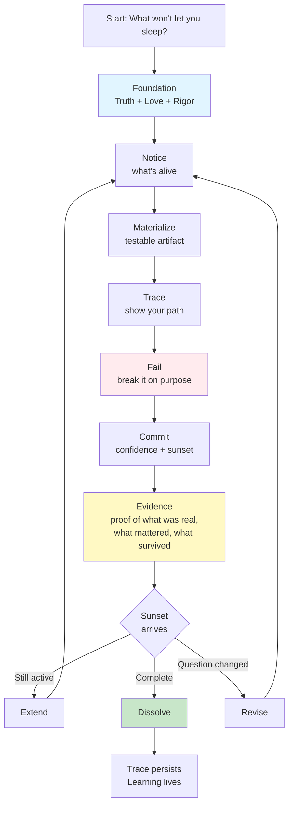
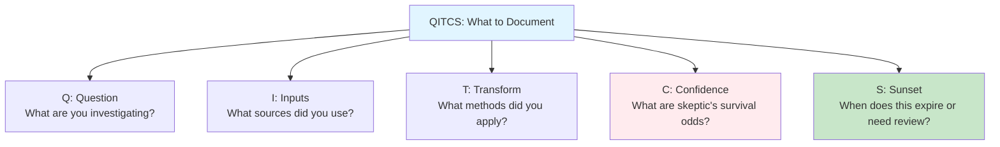
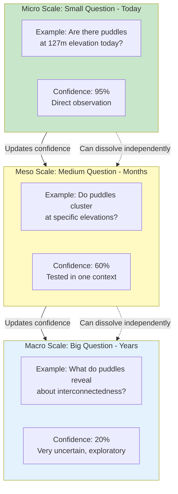
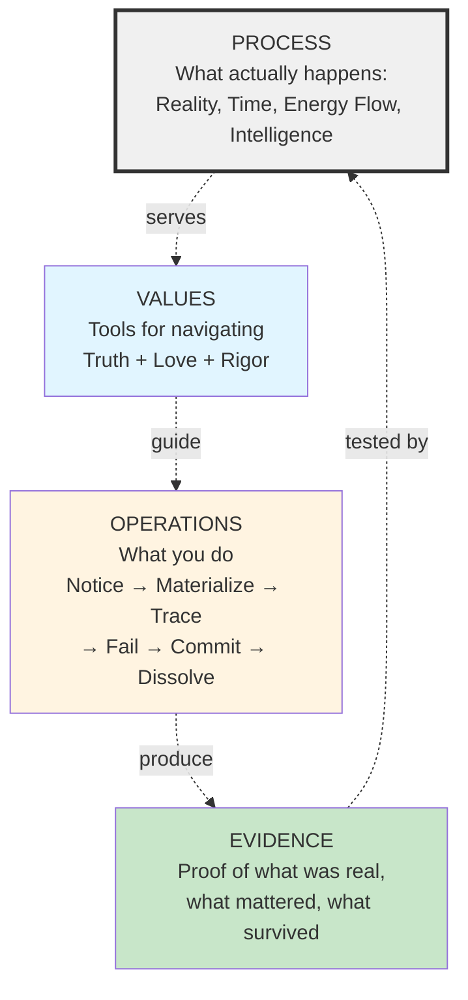
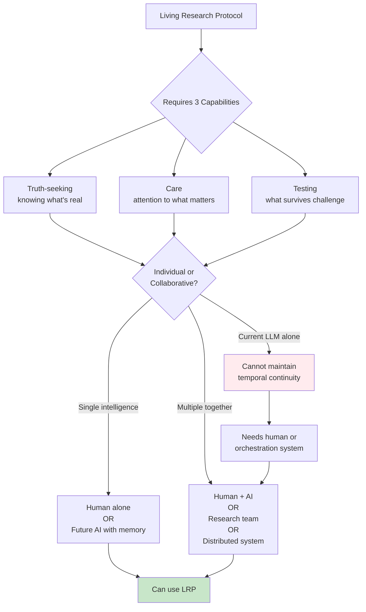
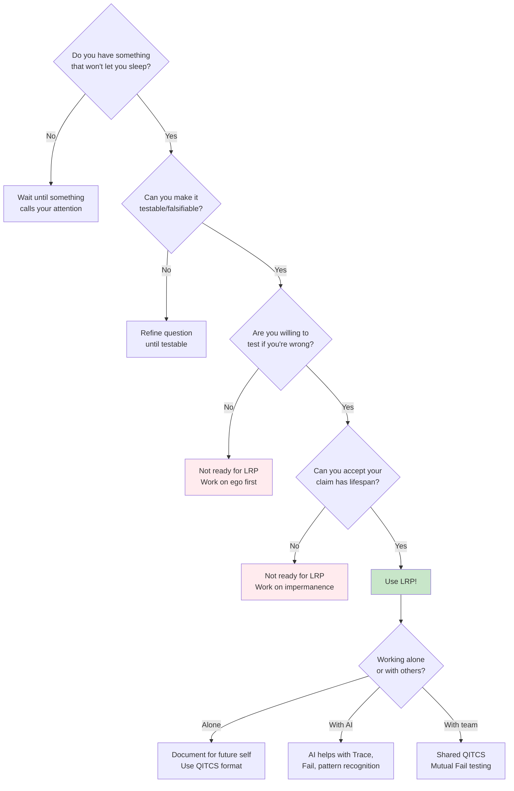
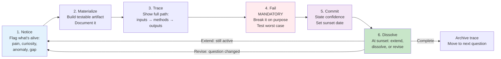
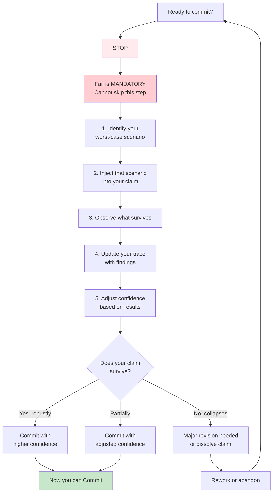
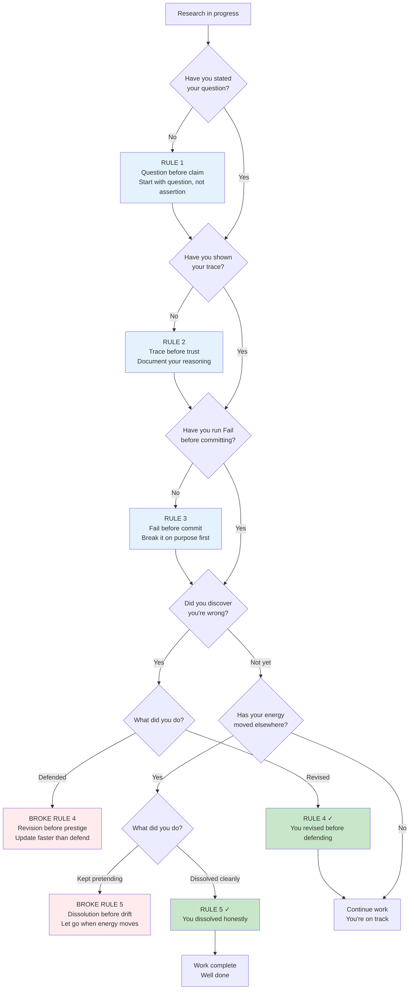

# Living Research Protocol - Visual Guide
*Choose your path based on how you learn*

---

## START HERE: The One Diagram Everyone Needs

This shows the complete protocol in 30 seconds:

**If this makes sense, you're ready to start using LRP.**

**If you want deeper understanding, choose your learning path below.**

---

## Learning Paths

### Path 1: I Learn By Doing
*Jump straight to the format and try it*

#### QITCS Format Reference

**Next:** Just start documenting. Iterate as you learn.

---

### Path 2: I Need to See the Big Picture
*Understand the structure before starting*

#### How Claims at Different Scales Work Together

**Key insight:** Your research is a living system of mortal claims at different scales. Small failures don't destroy big questions - they update understanding.

#### Process Above Values

**Key insight:** The protocol serves the process (what actually happens), not the values. Values are tools, not the destination.

---

### Path 3: I'm Skeptical - Convince Me
*Show me edge cases and who this works for*

#### Who Can Use This Protocol?

**Key insight:** The capabilities can be distributed. Current LLMs need human collaboration; future AI with memory won't.

#### Decision: Should I Use This?

**Key insight:** LRP requires three things - willingness to test your ideas, accept they're mortal, and document your reasoning.

---

### Path 4: I Need Step-by-Step Instructions
*Tell me exactly what to do*

#### The Operations Cycle (What to Do When)

**Next:** Start at Notice. Work through each step. Repeat the cycle.

#### How to Run Fail() (Step-by-Step)

**Key insight:** Fail() is not optional. You must try to break your work before claiming confidence.

---

### Path 5: I Want to Check My Work
*Am I doing this right?*

#### The Five Rules as Checkpoints

**Use this as self-check:** Are you following the rules or breaking them?

---

## How to Use This Guide

### In Your GitHub README:
Copy the entire entry point diagram plus your chosen learning path(s).

### For Quick Reference:
Bookmark the entry point diagram. Come back to learning paths when stuck.

### For Teaching:
- Show entry point first (30 seconds)
- Then ask: "What's your learning style?"
- Direct to appropriate path

### For Video:
- Screen record entry point (under 1 minute)
- Show 2-3 learning paths as "choose your adventure"
- Don't try to show all paths

---

## Technical Notes

### GitHub Rendering:
These diagrams use Mermaid syntax and will auto-render in GitHub markdown files. Just paste the code blocks as-is.

### Export as Images:
1. Paste into GitHub (renders automatically)
2. Screenshot the rendered diagram, OR
3. Use https://mermaid.live to export as PNG/SVG

### Customize:
All diagrams are editable. Change colors, text, structure as needed.

### Color Coding:
- Blue (#e1f5ff, #e3f2fd) = Foundation, principles
- Yellow (#fff9c4, #fff4e1) = Evidence, operations
- Red (#ffebee, #ffcdd2) = Critical actions (Fail), warnings
- Green (#c8e6c9) = Completion, success states
- Gray (#f0f0f0) = Process, meta-level

---

**Version 4.0 | November 2025**

**All diagrams reflect:**
- Truth, Love, Rigor (three values)
- Process above values
- Evidence as proof
- Individual or collaborative capabilities
- Mandatory Fail() before Commit()
- Fractal structure
- Five rules
